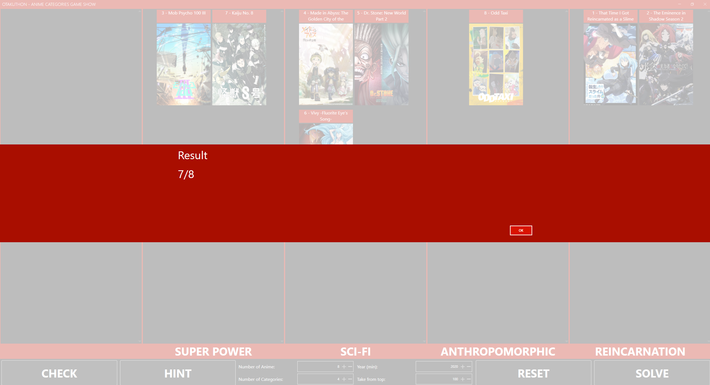

# OtakuthonGameShows

This is a for fun project for Otakuthon.

I built this as a personal project and would love to help build more game shows for the next editions of Otakuthon.

My goal would be to make more game ideas come to life and improve the experience of everyone involved; players, crowd and staff hosting the games.

The data set currently used in the app is : https://www.kaggle.com/datasets/junaidk0012/anime-dataset-2024

This data set contains over 25 000 anime from MyAnimeList as of August 2024. The data source used by the app can easily be updated or changed in the future.

# Try it out
1. Download "ANIME CATEGORIES GAME VX.zip" at the root of the project to try it out
1. Unzip wherever you want on your computer
1. Open the folder and start "AnimeCategories.exe"
1. It is possible it will ask you to download Microsoft .NET runtime libraries to run the app, follow the link and download+install them.
1. It is possible that Windows will warn you that the .exe may be dangerous, you can click on "More Info" and then click on "Run Anyway" to run the app.

# Goal of the game
The game will generate a number of anime and a number of categories and you need to classify each anime in the correct category by drag and dropping them.

# Screenshots
   
   
   
   

# Configuration
Each game can be configured in the app using the configuration fields at the bottom
* **Number of Anime:** This is the amount of different anime you will have to classify.
* **Number of Categories:** This is the amout of different categories that will be available to classify the anime.
* **Year (min):** This is the minimum year from which to pull the anime. Ex: "2020" will only select anime from the year 2020 and higher.
* **Take from top:** The app will sort the anime by score and take only the top X highest rated anime. Ex: "100" will only take anime from the top 100 scores.
* Example:
    * **Number of Anime:** 8
    * **Number of Categories:** 4
    * **Year (min):** 2000
    * **Take from top:** 1000
    * This configuration will pull 8 anime from the Top 1000 highest rated anime since the year 2000 and will offer 4 different categories to classify them in.

# Features
* **CHECK:** This button will tell you how many of the anime are in the right category.
* **HINT:** This button will tell you which anime are in the wrong category.
* **RESET:** This button will generate a completely new game with the configuration in the bottom center of the app.
* **SOLVE:** This button will move all the anime in the correct category to show the solution.

# General Rules built in the app
* There is no limit to how many anime you can generate, however the app will display a message if the configuration is impossible to generate. Generally this means there are not enough anime to pull from with the current config or it wasn't able to find a combination of categories that would work for the amount of anime.
* The game will try to make it so that each category can fit at least one anime, but it is not 100% guaranteed.
* The app only shows anime that have the type "TV" or "Movie"
* A single anime can fit in multiple different categories.

